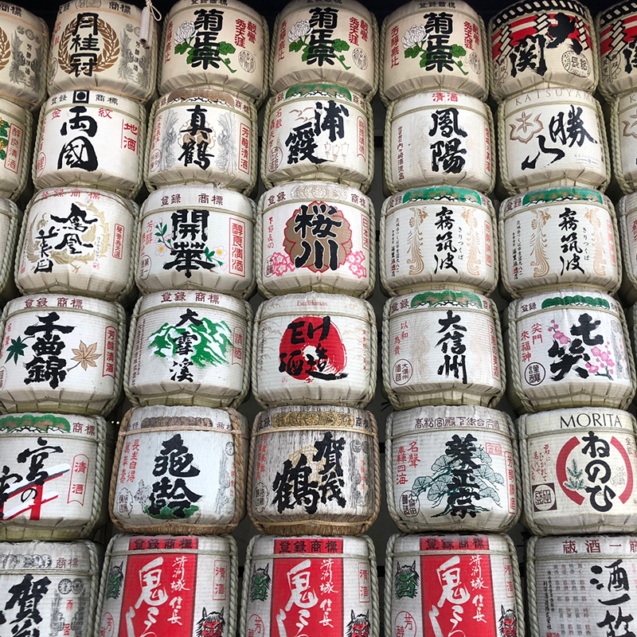
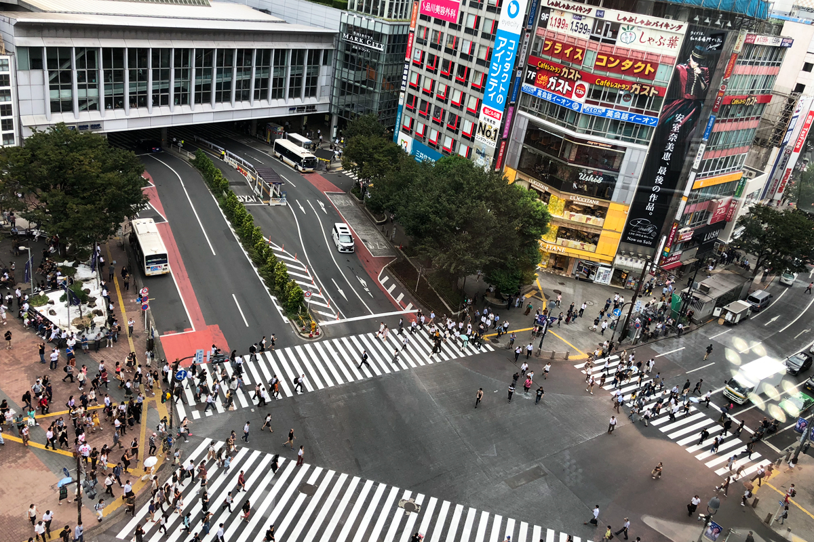
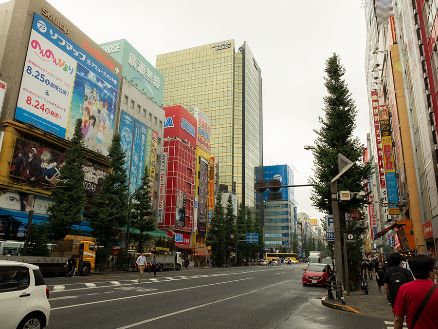

**Tokyo (東京 Tōkyō)** is one of my favourite cities. When I first arrived in Japan, I knew Tokyo was definitely going to be the first city to visit. Before making this trip, I wanted to get the best flight and hotel deals I could find. I strongly suggest installing some apps like Hopper, Expedia and Skyscanner on your mobile phone and turn on the alert feature to inform you when the good deals are available. Start planning ahead, at least 3 months before making the trip and don't hesitate once you see a good deal because it won't last long. Buy the plane tickets first, and everything else will fall into place.

I scored two Economy class tickets about 6 months before the trip. The final price per ticket came to $750.00 CAD for round-trip direct flights from Vancouver to Tokyo with ANA (All Nippon Airways). Overall an amazing deal and the flight experience was above our expectation; from the food & beverage selections, aircraft cleanliness, service, convenience, and the in-flight entertainment.

For the first 2 nights, we stayed at the Grand Panex Hotel in Kamata. Although it's not a central area, I would say the location is quite convenient because Kamata station is a JR line station, and there were many restaurants and stores nearby the hotel.

For our first full day in Tokyo, we went to Tsukiji market. It's one of Japan's famous fish markets and a definite must to visit if you're in Tokyo. In Tsukiji there are two main areas: the outer market and inner market. The inner market is where they hold the famous daily fish auction. Unfortunately, I didn't witness the auction because you'll need to be there at least by 3:00am, and that's not even a guarantee because they limit the number of public viewers for the auction. In the outer market area there are many restaurants and shops where they sell different kinds of food, particularly seafood. However just last year, Tsukiji market closed and moved to Toyosu Market.

    

        
    

    

        
    

Near Tsukiji there is a popular district called Ginza, which is the popular upscale shopping district in Tokyo lined with expensive boutique shops and high-end restaurants. Close to Ginza, you can also make a brief visit to the Imperial Palace where the Japanese royal family live. It’s about a 20-minute walk from Ginza area to the west gate of the Imperial Palace gate. However, if you want to go inside the palace you'll have to reserve online a few months before your trip, which we decided not to do and just walked around the palace garden areas and several defence forts that were free and open to the public.

    

        
    

    

        
    

Another area that we visited frequently was Shibuya, which is very close to Shinjuku and Harajuku. It's definitely where younger crowds go to hang out, shop and eat.  I would say go to Shibuya and Shinjuku if you wanna eat and shop until you drop. If you’re into the colorful fashion scene and cosplay go to Harajuku at night, and if you're there in the daytime, you can definitely stop by Yoyogi park and the Meiji Jingu temple.

    

        
    

    

        
    

    

        
    

    

        
    

But out of all these places, my favourite area in Tokyo would be Akihabara. Believe me that place is so amazing especially if you're an otaku (a Japanese term for people with obsessive interests, particularly in anime and manga). I like gadgets and anime, and have just recently started my collection of Tamiya plastic models. I made sure to stock up on everything that I couldn’t find in Vancouver especially since it's much cheaper in Japan. There are tons of selections here if you're into games, electronics, and other geeky stuff and the best place to shop would be at Yodobashi Camera. Yodobashi Camera is the biggest electronic store with more than 10 stories of items from cameras, games, stationary, beauty products, etc. Another store that you shouldn't miss out on is Don Quijote, which would be the best place if you're on a budget since they sell their items at almost 800-1000 yen cheaper compared to other stores.

    

        
    

    

        
    

    

      
    

    

        
    

If you have time to spare, another good place to visit is Odaiba. There's a big shopping mall with shops, restaurants and a takoyaki museum. It's also where you can find the real-size Gundam, jump in line and visit the Borderless TeamLab museum, check out an onsen, take a ride on the ferris wheel, go up the observatory, and spot a Mario Kart race that might be happening somewhere on the streets.

Overall, I had an amazing experience in Tokyo. I like the city and the people there. Although it's a bustling metropolitan area, people were very nice, polite, and accommodating even when you don't speak that much Japanese. If Tokyo itself was this amazing, I can't wait to see and explore the rest of Japan. Thanks for visiting my blog! Stay tuned for the next post!

