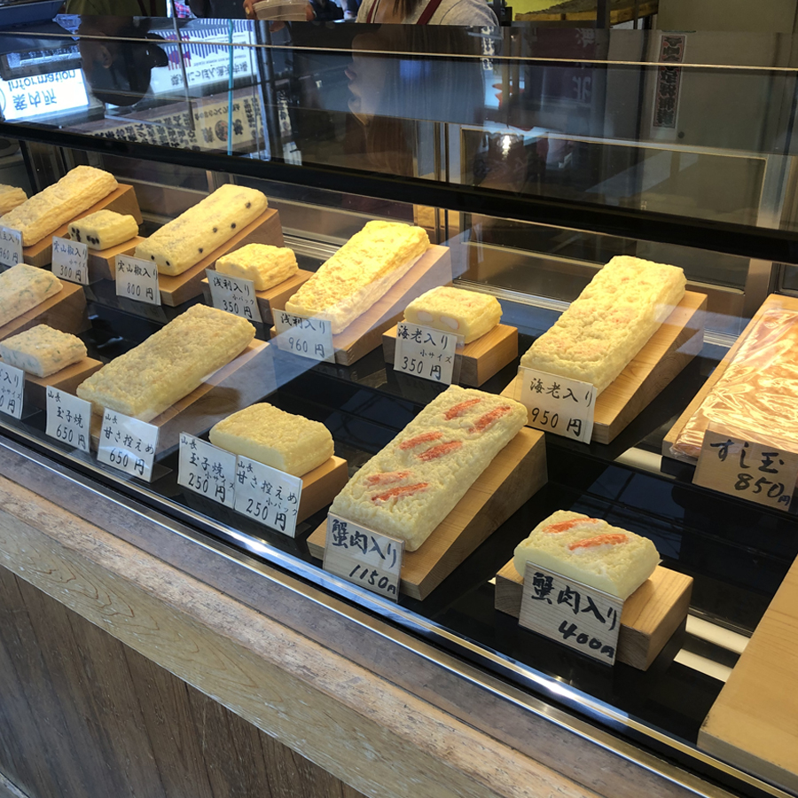
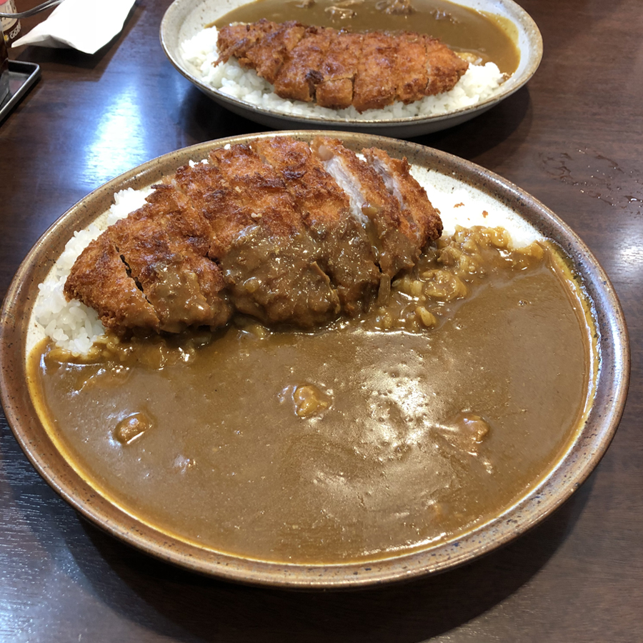

One of the reason I went to Japan was because I wanted to experience their food culture. In Vancouver, Japanese food is very popular like sushi, tempura, and ramen. I think the reason people like Japanese food is because their dishes are relatively tasty and not too spicy. That's why people from different cultures can easily eat and appreciate Japanese cuisine.

During my trip, I visited Tokyo, Yokohama, Shizuoka, Osaka, Kyoto, Kobe, and Hiroshima. Each city has their own specialty and don't be surprised if you can even find good restaurants inside the train station. Japanese people are very passionate about their food and that's why their food culture is vibrant and rich, and they are very open about exploring other food culture from different parts of the world. Here are the photos of what I ate during my trip. Enjoy!

