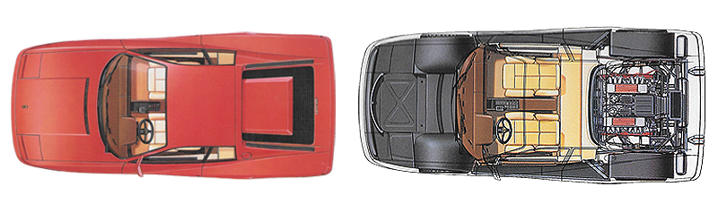
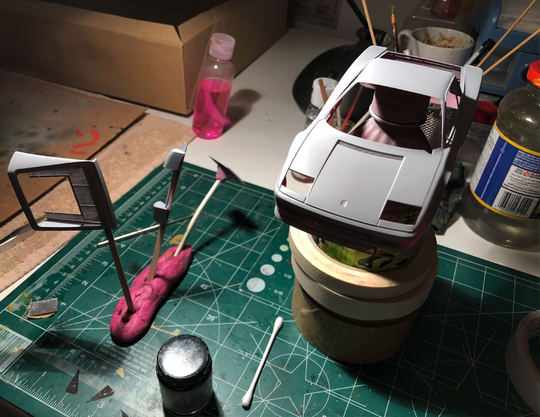
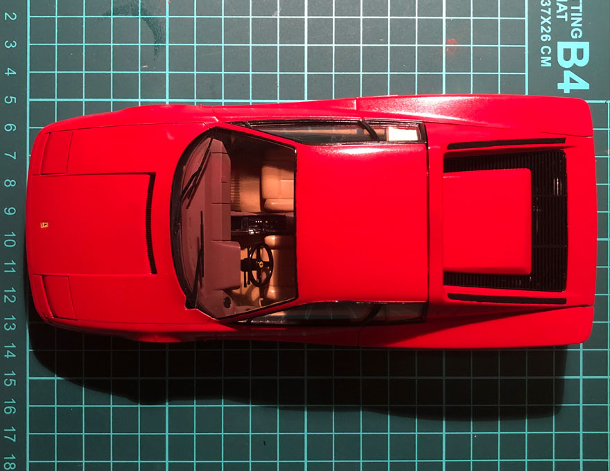

When I was watching a <a target="_blank" href="https://www.youtube.com/watch?v=kMM8i5nIQ00">YouTube video</a> from Petrolicious about Ferrari Testarossa, it reminded me about this car poster from back in the early 90s, and this model remains to be one of my favourite Ferrari models of all time. To me, Testarossa represents how the supercar should look like; it has a fiery red colour and it still looks fast even without seeing it running. That video inspired me to work on the scale model for that car. Luckily I found the model from eBay made by Japanese manufacture called Tamiya. If you're interested you can buy it <a target="_blank" href="https://www.ebay.ca/sch/i.html?_ssc=1&_nkw=tamiya+ferrari+testarossa">here</a>.

When I received the box, I like how it looks. From the look of it, it gets me excited.

  

On the side part of the box, it has an illustration of how the car should look like from outside and inside. I would make it similar.

  

I started working on the engine and cockpit. Although those parts have a lot of detail, I think the paint job is more forgiving, because I didn't need to do any polishing for a realistic result.

  

  

  

  

  

  

Like the shape and colour of Testarossa's engine and the colour of red gives a nice contrast from dominant black and silver colours.

  

For this project, I chose traditional Ferrari colours. I chose the beige colour for most of the interior parts and Italian red for the body.

  

  

  

  

I feel that I need to improve more working on the body part, especially the polishing technique, which is the hardest to master in my opinion. After I did the paint job for the red body, I did a lot of masking especially for the black window frames which are very meticulous processes.

  

  

  

  

Overall I enjoyed the experience building it and very satisfied with the result. In the future, I might try to build this model again in a different colour. Thank you for reading this post and stay tuned.