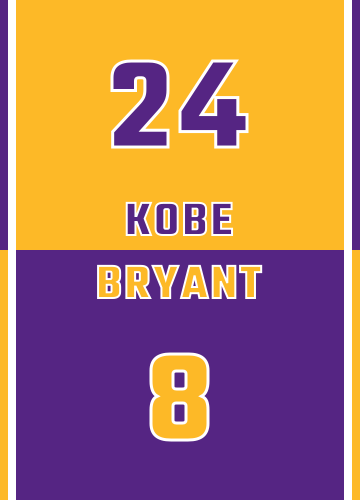

I was so shocked and sad when I heard Kobe just died at a relatively young age as a sportsman retiree. I remember his first season played as a rookie against Michael Jordan, everyone knew he would be the future star.

During his playing time, he was a prolific scoring machine and a leader on the court. He won games even though he wasn't in perfect condition. Besides his offence, he is also a tenacious defender and always did his best in every game. His work ethic inspired many people including myself. Goodbye legend, you will always be remembered.