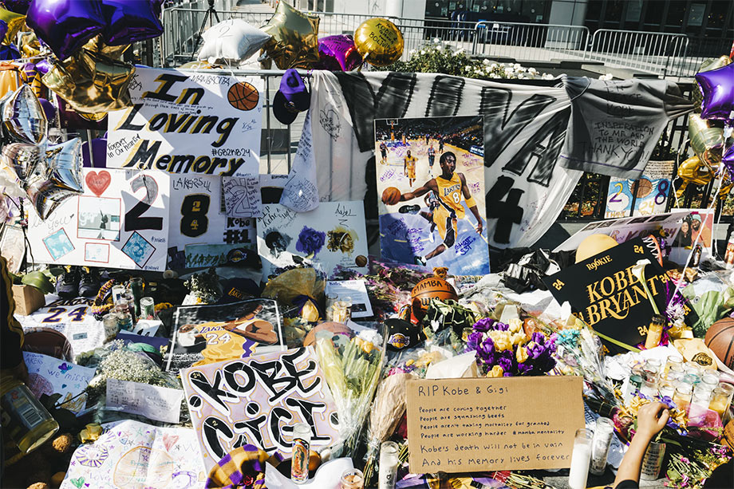

  

It was a sad day for me when I heard Kobe just died at a relatively young age as a sportsman retiree. His talent was apparent in his early career. He was drafted by the NBA straight from high school, where most players usually get drafted when they are in college. I remember when he was an NBA rookie against Michael Jordan, everyone knew he would be the future star.

During his playing time, he was a prolific scoring machine and a leader on the court. Besides his famous offense play, he is also a tenacious defender and always did his best in every game. Not only his talent but his work ethic inspired many people, including myself. He won games even though he wasn't in perfect condition. His dedication earned him 5x NBA champions `(2000–2002, 2009, 2010)`, 2x NBA Finals MVP `(2009, 2010)`, 18x NBA All-Star `(1998, 2000–2016)`, 4× NBA All-Star Game MVP `(2002, 2007, 2009, 2011)` and a season MVP in `2008`.

He died at age 41, along with his daughter Gianna on January 24, 2020, in a helicopter crash. Los Angeles Lakers retired his jersey number 8 & 24 to honor him. Thank you, Kobe, for all the inspiration and all good memories. Goodbye legend, you will always be remembered as one of the greatest.